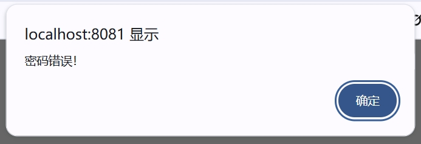

# JavaWeb课程设计--多功能小世界

## 一、**课题介绍**

登录页：

 

用户名密码不匹配：

 

注册页：

 

进去后，主页整合了上课讲过的三个小功能。

 

第一个，乘法答题

 

随机生成个位数乘法题，一共有四题，全部答完显示：

 

接下来，返回主页，心理测试：

 

数据库内目前只存了三题，后续可以完善。

测试结果如下：不同情况如下

 

 

第三个功能，猜数字游戏

 

 

 

然后是退出登录页：（并非注销）

 

3秒后跳转登录页。

## **二、分析与设计**

按设计过程写，写明数据库表和各个包、类的作用，对所遇到的问题和解决方法一并记录

#### 1.首先采用了MVC三层结构：

表示层（View）：JSP 页面实现用户交互界面。

控制层（Controller）：Servlet 控制业务流程。

持久层（DAO + Entity）：使用 MyBatis 实现数据库访问和映射。

#### 2. 数据库设计

本系统主要涉及以下四张表：

| 表名      | 说明           | 主要字段                                     |
| --------- | -------------- | -------------------------------------------- |
| users     | 用户信息表     | id, username, password                       |
| questions | 心理测试题目表 | id, question                                 |
| options   | 测试选项表     | id, question_id, option_text, score          |
| results   | 测试结果表     | id, score_range_min, score_range_max, result |

 

#### 3.包与类结构

在老师给的MVC三层结构的基础上进行调整修改和补充。

项目中各包和类的功能如下：

（1）com.kk.entity 实体类包

User：用户实体，映射 users 表。

Question：题目实体，包含题干及选项集合（List<Option>）。

Option：选项实体，含选项文本与分值。

 

User.java:

`package com.kk.entity;`

`` 

`public class User {`

  `private int id;`

  `private String username;`

  `private String password;`

  `private String name; // 这是 nickname`

`` 

  `public User() {}`

`` 

  `public User(String username, String password, String name) {`

​    `this.username = username;`

​    `this.password = password;`

​    `this.name = name;`

  `}`

`` 

  `// Getter/Setter`

  `public int getId() { return id; }`

  `public void setId(int id) { this.id = id; }`

`` 

  `public String getUsername() { return username; }`

  `public void setUsername(String username) { this.username = username; }`

`` 

  `public String getPassword() { return password; }`

  `public void setPassword(String password) { this.password = password; }`

`` 

  `public String getName() { return name; }`

  `public void setName(String name) { this.name = name; }`

`}`

Option.java:

package com.kk.entity;

 

public class Option {

  private int id;

  private int questionId;

  private String optionText;

  private int score;

 

  // getter 和 setter

  public int getId() {

​    return id;

  }

 

  public void setId(int id) {

​    this.id = id;

  }

 

  public int getQuestionId() {

​    return questionId;

  }

 

  public void setQuestionId(int questionId) {

​    this.questionId = questionId;

  }

 

  public String getOptionText() {

​    return optionText;

  }

 

  public void setOptionText(String optionText) {

​    this.optionText = optionText;

  }

 

  public int getScore() {

​    return score;

  }

 

  public void setScore(int score) {

​    this.score = score;

  }

}

Question.java:

package com.kk.entity;

import java.util.List;

public class Question {

  private int id;

  private String question;

  private List<Option> options;

 

  // getter 和 setter

  public int getId() { return id; }

  public void setId(int id) { this.id = id; }

 

  public String getQuestion() { return question; }

  public void setQuestion(String question) { this.question = question; }

 

  public List<Option> getOptions() { return options; }

  public void setOptions(List<Option> options) { this.options = options; }

}

（2）com.kk.dao 数据访问层

UserDao.xml：实现用户登录校验与注册。

<?xml version="1.0" encoding="UTF-8"?>

<!DOCTYPE mapper

 PUBLIC "-//mybatis.org//DTD Mapper 3.0//EN"

 "http://mybatis.org/dtd/mybatis-3-mapper.dtd">

<mapper namespace="com.kk.dao.UserDao">

 <select id="findByUsername" resultType="com.kk.entity.User">

  select * from users where username = #{username}

 </select>

 <select id="findByUsernameAndPassword" resultType="com.kk.entity.User">

  select * from users where username = #{username} and password = #{password}

 </select>

 

 <insert id="addUser" useGeneratedKeys="true" keyProperty="id">

 insert into users (username, password, nickname)

 values (#{username}, #{password}, #{name})

</insert>

 <select id="findAllUsers" resultType="com.kk.entity.User">

  select * from users

 </select>

</mapper>

QuizDao.xml：实现题目与选项的联合查询（使用 resultMap 映射）。

<?xml version="1.0" encoding="UTF-8" ?>

<!DOCTYPE mapper

 PUBLIC "-//mybatis.org//DTD Mapper 3.0//EN"

 "http://mybatis.org/dtd/mybatis-3-mapper.dtd">

<mapper namespace="com.kk.dao.QuizDao">

 

  <resultMap id="questionMap" type="com.kk.entity.Question">

​    <id property="id" column="id"/>

​    <result property="question" column="question"/>

​    <collection property="options" ofType="com.kk.entity.Option">

​      <id property="id" column="option_id"/>

​      <result property="questionId" column="question_id"/>

​      <result property="optionText" column="option_text"/>

​      <result property="score" column="score"/>

​    </collection>

  </resultMap>

 

  <select id="getAllQuestionsWithOptions" resultMap="questionMap">

​    SELECT

​      q.id,

​      q.question,

​      o.id AS option_id,

​      o.question_id,

​      o.option_text,

​      o.score

​    FROM questions q

​    LEFT JOIN options o ON q.id = o.question_id

​    ORDER BY q.id, o.id

  </select>

 <select id="getResultByScore" parameterType="map" resultType="java.lang.String">

  SELECT result_text 

  FROM results

  WHERE #{score} BETWEEN min_score AND max_score

</select>

</mapper>

（3）com.kk.util 工具类包

MyBatisUtil：封装 SqlSessionFactory，便于获取 SqlSession。

package class7;

import java.io.IOException;

import java.io.InputStream;

import org.apache.ibatis.io.Resources;

import org.apache.ibatis.session.SqlSession;

import org.apache.ibatis.session.SqlSessionFactory;

import org.apache.ibatis.session.SqlSessionFactoryBuilder;

 

public class MyBatisUtil {

 

 private static SqlSessionFactory sqlSessionFactory;

 

 static //静态代码块，在类加载时就执行

 {

  try

  {

   String resource = "mybatis-config.xml";

   InputStream inputStream = Resources.getResourceAsStream(resource);

   sqlSessionFactory = new SqlSessionFactoryBuilder().build(inputStream);

  }

  catch(IOException e)

  {

   e.printStackTrace();

  }

 }

 

 public static SqlSession getSession()

 {

  return sqlSessionFactory.openSession(true);

 }

 

}

（4）com.kk.controller包：

 

UserController.java:

package com.kk.controller;

 

import com.kk.entity.User;

import com.kk.exception.UserException;

import com.kk.service.UserService;

import org.apache.ibatis.io.Resources;

import org.apache.ibatis.session.*;

 

import javax.servlet.ServletException;

import javax.servlet.annotation.WebServlet;

import javax.servlet.http.*;

import java.io.*;

 

@WebServlet(urlPatterns = {"/login", "/register"})

public class UserController extends HttpServlet {

  private static final long serialVersionUID = 1L;

 

  private UserService userService;

 

  @Override

  public void init() throws ServletException {

​    try {

​      // 初始化 MyBatis

​      String resource = "mybatis-config.xml";

​      InputStream inputStream = Resources.getResourceAsStream(resource);

​      SqlSessionFactory sqlSessionFactory = new SqlSessionFactoryBuilder().build(inputStream);

​      

​      // 手动注入 UserService（也可以用 Spring 后续再说）

​      userService = new UserService(sqlSessionFactory);

​    } catch (IOException e) {

​      throw new ServletException("MyBatis 初始化失败", e);

​    }

  }

 

  @Override

  protected void doPost(HttpServletRequest request, HttpServletResponse response)

​      throws ServletException, IOException {

​    String servletPath = request.getServletPath(); // /login or /register

 

​    if ("/login".equals(servletPath)) {

​      handleLogin(request, response);

​    } else if ("/register".equals(servletPath)) {

​      handleRegister(request, response);

​    }

  }

 

  private void handleLogin(HttpServletRequest request, HttpServletResponse response)

​      throws IOException {

​    String username = request.getParameter("username");

​    String password = request.getParameter("password");

 

​    try {

​      User user = userService.login(username, password);

​      // 登录成功：放入 session

​      request.getSession().setAttribute("currentUser", user);

​      response.sendRedirect("welcome.jsp");

​    } catch (UserException e) {

​      sendAlert(response, e.getMessage(), "index.html");

​    }

  }

 

  private void handleRegister(HttpServletRequest request, HttpServletResponse response)

​      throws IOException {

​    String username = request.getParameter("username");

​    String password = request.getParameter("password");

​    String name = request.getParameter("name");

 

​    User newUser = new User(username, password, name);

 

​    try {

​      userService.register(newUser);

​      sendAlert(response, "注册成功！请登录", "index.html");

​    } catch (UserException e) {

​      sendAlert(response, e.getMessage(), "register.html");

​    }

  }

 

  private void sendAlert(HttpServletResponse response, String message, String redirectUrl)

​      throws IOException {

​    response.setContentType("text/html;charset=UTF-8");

​    PrintWriter out = response.getWriter();

​    out.printf("", message, redirectUrl);

  }

}

（5）com.kk.dao包

 

QuizDao.java:

package com.kk.dao;

import java.util.List;

import com.kk.entity.Question;

import com.kk.entity.Option;

public interface QuizDao {

 

  // 查询所有题目

  List<Question> findAllQuestions();

 

  // 根据题目ID查询选项

  List<Option> findOptionsByQuestionId(int questionId);

}

UserDao.java:

package com.kk.dao;

import java.util.List;

import org.apache.ibatis.annotations.Param;

import com.kk.entity.User;

 

public interface UserDao {

 

 User findByUsername(String username);

 User findByUsernameAndPassword(@Param("username") String username, @Param("password") String password);

 

 int addUser(User user);

 

 List<User> findAllUsers();

}

 

（6）com.kk.exception包

 

package com.kk.exception;

 

public class UserException extends Exception {

 

 public UserException(String message)

 {

  super(message);

 }

}

（7）com.kk.service包

 

package com.kk.service;

 

import com.kk.dao.UserDao;

import com.kk.entity.User;

import com.kk.exception.UserException;

import org.apache.ibatis.session.SqlSession;

import org.apache.ibatis.session.SqlSessionFactory;

 

public class UserService {

  private final SqlSessionFactory factory;

 

  public UserService(SqlSessionFactory factory) {

​    this.factory = factory;

  }

 

  // 登录方法

  public User login(String username, String password) throws UserException {

​    if (username == null || username.trim().isEmpty()) {

​      throw new UserException("请输入用户名！");

​    }

​    if (password == null || password.trim().isEmpty()) {

​      throw new UserException("请输入密码！");

​    }

 

​    try (SqlSession session = factory.openSession()) {

​      UserDao userDao = session.getMapper(UserDao.class);

​      User user = userDao.findByUsername(username);

​      if (user == null) {

​        throw new UserException("该用户名不存在！");

​      }

​      if (!user.getPassword().equals(password)) {

​        throw new UserException("密码错误！");

​      }

​      return user;

​    }

  }

 

  // 注册方法

  public void register(User user) throws UserException {

​    if (user == null) {

​      throw new UserException("用户信息不能为空！");

​    }

​    if (user.getUsername() == null || user.getUsername().trim().isEmpty()) {

​      throw new UserException("请输入用户名！");

​    }

​    if (user.getPassword() == null || user.getPassword().trim().isEmpty()) {

​      throw new UserException("请输入密码！");

​    }

 

​    try (SqlSession session = factory.openSession(true)) { // 自动提交事务

​      UserDao userDao = session.getMapper(UserDao.class);

 

​      User existingUser = userDao.findByUsername(user.getUsername());

​      if (existingUser != null) {

​        throw new UserException("用户名已存在！");

​      }

 

​      int result = userDao.addUser(user);

​      if (result != 1) {

​        throw new UserException("注册失败，请重试！");

​      }

​    }

  }

}

（8）mybatis-config.xml和MyBatisUtil.java

mybatis-config.xml:

<?xml version="1.0" encoding="UTF-8"?>

<!DOCTYPE configuration

 PUBLIC "-//mybatis.org//DTD Config 3.0//EN"

 "http://mybatis.org/dtd/mybatis-3-config.dtd">

<configuration>

 <environments default="development">

  <environment id="development">

   <transactionManager type="JDBC"/>

   <dataSource type="POOLED">

​    <property name="driver" value="org.sqlite.JDBC"/>

​    <property name="url" value="jdbc:sqlite://d:/any/JavaWeb/sqlite3/user.db"/>

​    <property name="username" value=""/>

​    <property name="password" value=""/>

   </dataSource>

  </environment>

 </environments>

 <mappers>

  <mapper resource="UserDao.xml"/>

  <mapper resource="QuizDao.xml"/>

 </mappers>

</configuration>

MyBatisUtil.java:

package class7;

 

import java.io.IOException;

import java.io.InputStream;

 

import org.apache.ibatis.io.Resources;

import org.apache.ibatis.session.SqlSession;

import org.apache.ibatis.session.SqlSessionFactory;

import org.apache.ibatis.session.SqlSessionFactoryBuilder;

 

public class MyBatisUtil {

 

 private static SqlSessionFactory sqlSessionFactory;

 

 static //静态代码块，在类加载时就执行

 {

  try

  {

   String resource = "mybatis-config.xml";

   InputStream inputStream = Resources.getResourceAsStream(resource);

   sqlSessionFactory = new SqlSessionFactoryBuilder().build(inputStream);

  }

  catch(IOException e)

  {

   e.printStackTrace();

  }

 }

 

 public static SqlSession getSession()

 {

  return sqlSessionFactory.openSession(true);

 }

}

（9）JSP 页面（前端）

index.html：登录入口页面。

<!DOCTYPE html>

<html lang="zh">

<head>

    <meta charset="UTF-8">

  <title>用户登录</title>

    

</head>

<body class="bg-gradient-to-r from-blue-500 to-purple-600 min-h-screen flex items-center justify-center">

    

​    <h2 class="text-3xl font-bold text-center text-gray-800 mb-6">用户登录</h2>

 

​    <form action="login" method="post" class="space-y-5">

            

​        <label for="username" class="block text-sm font-medium text-gray-700">用户名</label>

​        <input type="text" id="username" name="username" required

​            class="mt-1 w-full px-4 py-2 border border-gray-300 rounded-xl focus:ring-2 focus:ring-blue-400 focus:outline-none"/>

​      

 

            

​        <label for="password" class="block text-sm font-medium text-gray-700">密码</label>

​        <input type="password" id="password" name="password" required

​            class="mt-1 w-full px-4 py-2 border border-gray-300 rounded-xl focus:ring-2 focus:ring-blue-400 focus:outline-none"/>

​      

 

            

​        <label>

​          <input type="checkbox" name="remember" class="mr-1" /> 记住我

​        </label>

                <a href="#" class="text-blue-500 hover:underline">忘记密码？</a>

​      

 

​      <button type="submit"

​          class="w-full bg-blue-500 text-white py-2 rounded-xl hover:bg-blue-600 transition duration-200">

​        登录

​      </button>

​    </form>

 

        

​      没有账号？

            <a href="register.html" class="text-purple-500 hover:underline">注册</a>

​    

 

​    <!-- 登录失败消息 (通过URL参数传递 error=...) -->

        

  

 

    

</body>

</html>

register.html：用户注册页面。

<!DOCTYPE html>

<html lang="zh">

<head>

    <meta charset="UTF-8">

  <title>用户注册</title>

    

</head>

<body class="bg-gradient-to-r from-green-400 to-blue-500 min-h-screen flex items-center justify-center">

    

​    <h2 class="text-3xl font-bold text-center text-gray-800 mb-6">用户注册</h2>

​    <form method="post" action="register" class="space-y-5">

            

​        <label for="username" class="block text-sm font-medium text-gray-700">用户名</label>

​        <input type="text" name="username" id="username" required

​            class="mt-1 w-full px-4 py-2 border border-gray-300 rounded-lg focus:ring-2 focus:ring-green-400 focus:outline-none"/>

​      

 

            

​        <label for="password" class="block text-sm font-medium text-gray-700">密码</label>

​        <input type="password" name="password" id="password" required

​            class="mt-1 w-full px-4 py-2 border border-gray-300 rounded-lg focus:ring-2 focus:ring-green-400 focus:outline-none"/>

​      

 

            

​        <label for="name" class="block text-sm font-medium text-gray-700">姓名</label>

​        <input type="text" name="name" id="name" required

​            class="mt-1 w-full px-4 py-2 border border-gray-300 rounded-lg focus:ring-2 focus:ring-green-400 focus:outline-none"/>

​      

 

            

​        <button type="submit"

​            class="w-1/2 bg-green-500 text-white py-2 rounded-lg hover:bg-green-600 transition duration-200">

​          注册

​        </button>

​        <button type="button"

​            onclick="window.location.href='index.html'"

​            class="w-1/2 bg-gray-300 text-gray-700 py-2 rounded-lg hover:bg-gray-400 transition duration-200">

​          返回登录

​        </button>

​      

​    </form>

  

</body>

</html>

welcome.jsp：登录后欢迎界面。

<%@ page language="java" contentType="text/html; charset=UTF-8"

  pageEncoding="UTF-8"%>

<!DOCTYPE html>

<html lang="zh">

<head>

    <meta charset="UTF-8">

  <title>多功能小世界</title>

    

</head>

<body class="bg-gradient-to-br from-blue-400 to-purple-500 min-h-screen flex items-center justify-center">

  <%

  com.kk.entity.User user = (com.kk.entity.User)session.getAttribute("currentUser");

​    if(user == null) {

​      response.sendRedirect("index.html");

​      return;

​    }

  %>

 

    

​    <h1 class="text-4xl font-bold text-gray-800 mb-4">�� 欢迎来到--多功能小世界</h1>

​    <h2 class="text-2xl text-purple-600 font-semibold mb-6">用户：<%= user.getUsername() %></h2>

        
请选择一个功能开始使用：

 

        

            <a href="test" class="bg-blue-500 text-white py-3 rounded-xl hover:bg-blue-600 transition">乘法答题</a>

            <a href="quiz.jsp" class="bg-green-500 text-white py-3 rounded-xl hover:bg-green-600 transition">心理测试</a>

            <a href="guess.jsp" class="bg-yellow-500 text-white py-3 rounded-xl hover:bg-yellow-600 transition">猜数字游戏</a>

            <a href="logout.jsp" class="bg-red-500 text-white py-3 rounded-xl hover:bg-red-600 transition">退出登录</a>

​    

  

</body>

</html>

quiz.jsp：心理测试答题页。

<%@ page language="java" contentType="text/html; charset=UTF-8" pageEncoding="UTF-8"%>

<%@ page import="java.util.*, com.kk.dao.*, com.kk.entity.*, org.apache.ibatis.session.*" %>

<%@ page import="org.apache.ibatis.io.Resources" %>

<%@ page import="java.io.InputStream" %>

<%@ page import="com.kk.entity.Question" %>

<%@ page import="com.kk.entity.Option" %>

 

<%

  String resource = "mybatis-config.xml";

  InputStream inputStream = Resources.getResourceAsStream(resource);

  SqlSessionFactory sqlSessionFactory = new SqlSessionFactoryBuilder().build(inputStream);

  SqlSession sqlSession = sqlSessionFactory.openSession();

  List<Question> questions = sqlSession.selectList("com.kk.dao.QuizDao.getAllQuestionsWithOptions");

  sqlSession.close();

%>

<!DOCTYPE html>

<html lang="zh">

<head>

    <meta charset="UTF-8">

  <title>心理测试</title>

    

</head>

<body class="bg-gradient-to-br from-pink-200 to-indigo-300 min-h-screen p-8">

  <form action="quizResult.jsp" method="post" class="bg-white p-6 rounded-xl max-w-2xl mx-auto shadow-lg">

​    <h1 class="text-3xl font-bold text-center text-purple-700 mb-6">心理健康测试</h1>

​    <%

  for (Question q : questions) {

%>

 

    

        
<%= q.getId() %>. <%= q.getQuestion() %>

​    <%

​      List<Option> opts = q.getOptions();

​      if (opts != null) {

​        for (Option o : opts) {

​    %>

​      <label class="block">

​        <input type="radio" name="q<%= q.getId() %>" value="<%= o.getScore() %>" required>

​        <%= o.getOptionText() %>

​      </label>

​    <%

​        }

​      } else {

​    %>

            
选项加载失败，请联系管理员。

​    <%

​      }

​    %>

  

<%

  }

%>

 

​    <button type="submit" class="bg-purple-600 text-white px-6 py-2 rounded hover:bg-purple-700">提交</button>

  </form>

</body>

</html>

quizResult.jsp：测试结果显示页面。

<%@ page language="java" contentType="text/html; charset=UTF-8" pageEncoding="UTF-8"%>

<%@ page import="java.util.*, com.kk.dao.*, org.apache.ibatis.session.*, org.apache.ibatis.io.Resources" %>

<%@ page import="java.io.InputStream" %>

 

<%

  String resource = "mybatis-config.xml";

  InputStream inputStream = Resources.getResourceAsStream(resource);

  SqlSessionFactory sqlSessionFactory = new SqlSessionFactoryBuilder().build(inputStream);

  SqlSession sqlSession = sqlSessionFactory.openSession();

 

  int totalScore = 0;

  for (String param : request.getParameterMap().keySet()) {

​    totalScore += Integer.parseInt(request.getParameter(param));

  }

 

  Map<String, Object> map = new HashMap<>();

  map.put("score", totalScore);

  String result = sqlSession.selectOne("com.kk.dao.QuizDao.getResultByScore", map);

  sqlSession.close();

%>

 

<!DOCTYPE html>

<html>

<head>

    <meta charset="UTF-8">

  <title>测试结果</title>

    

</head>

<body class="flex items-center justify-center min-h-screen bg-gradient-to-br from-green-200 to-blue-200">

    

​    <h2 class="text-2xl font-bold text-gray-800 mb-4">�� 心理测试结果</h2>

        
您的总得分为：<strong><%= totalScore %></strong>

        
<%= result %>

        <a href="welcome.jsp" class="mt-6 inline-block bg-blue-500 text-white px-6 py-2 rounded hover:bg-blue-600">返回主页</a>

  

</body>

</html>

logout.jsp：退出登录逻辑。

<%@ page language="java" contentType="text/html; charset=UTF-8" pageEncoding="UTF-8"%>

<%

  // 清除会话中的用户信息

  session.invalidate();

  // 3秒后跳转回首页

%>

<!DOCTYPE html>

<html lang="zh">

<head>

    <meta charset="UTF-8">

  <title>退出登录</title>

    

    <meta http-equiv="refresh" content="3;URL=index.html">

</head>

<body class="bg-gradient-to-br from-red-400 to-pink-500 min-h-screen flex items-center justify-center">

    

​    <h1 class="text-3xl font-bold text-gray-800 mb-4">�� 您已成功退出登录</h1>

        
感谢您的使用，我们期待您的再次访问！

        
页面将在 3 秒 后自动跳转到登录页面。

        <a href="index.html" class="inline-block mt-6 bg-blue-500 text-white px-6 py-2 rounded-xl hover:bg-blue-600 transition">立即跳转</a>

  

</body>

</html>

（10）在做乘法答题功能时补充了一个ResultServlet.java用于统计答题分数

package class7;

 

import javax.servlet.ServletException;

import javax.servlet.annotation.WebServlet;

import javax.servlet.http.HttpServlet;

import javax.servlet.http.HttpServletRequest;

import javax.servlet.http.HttpServletResponse;

import java.io.IOException;

 

@WebServlet("/score")

public class ReasultServlet extends HttpServlet {

  private static final long serialVersionUID = 1L;

 

  @Override

  protected void doPost(HttpServletRequest request, HttpServletResponse response) throws ServletException, IOException {

​    

​    String answersStr = request.getParameter("answers");

​    String correctAnswersStr = request.getParameter("correctAnswers");

​    String currentAnswer = request.getParameter("answer");

​    String num1Str = request.getParameter("num1");

​    String num2Str = request.getParameter("num2");

 

​    if (currentAnswer != null && num1Str != null && num2Str != null) {

​      try {

​        int userAnswer = Integer.parseInt(currentAnswer);

​        int num1 = Integer.parseInt(num1Str);

​        int num2 = Integer.parseInt(num2Str);

​        int correctAnswer = num1 * num2;

​        answersStr = answersStr == null ? String.valueOf(userAnswer) : answersStr + "," + userAnswer;

​        correctAnswersStr = correctAnswersStr == null ? String.valueOf(correctAnswer) : correctAnswersStr + "," + correctAnswer;

​      } catch (NumberFormatException e) {

​        answersStr = answersStr == null ? "0" : answersStr + ",0";

​        correctAnswersStr = correctAnswersStr == null ? "0" : correctAnswersStr + ",0";

​      }

​    }

 

​    int correctCount = 0;

​    if (answersStr != null && correctAnswersStr != null) {

​      String[] answers = answersStr.split(",");

​      String[] correctAnswers = correctAnswersStr.split(",");

​      for (int i = 0; i < answers.length && i < correctAnswers.length; i++) {

​        try {

​          if (Integer.parseInt(answers[i]) == Integer.parseInt(correctAnswers[i])) {

​            correctCount++;

​          }

​        } catch (NumberFormatException e) {

​          

​        }

​      }

​    }

 

​    int score = correctCount == 4 ? 100 : correctCount == 3 ? 75 : correctCount * 25;

 

​    request.setAttribute("score", score);

 

​    request.getRequestDispatcher("/WEB-INF/jsp/score.jsp").forward(request, response);

  }

}

（11）乘法答题功能的TestServlet.java

package class7;

 

import java.io.IOException;

import java.util.Random;

import javax.servlet.ServletException;

import javax.servlet.annotation.WebServlet;

import javax.servlet.http.HttpServlet;

import javax.servlet.http.HttpServletRequest;

import javax.servlet.http.HttpServletResponse;

 

@WebServlet("/test")

public class TestServlet extends HttpServlet {

  private static final long serialVersionUID = 1L;

 

  public TestServlet() {

​    super();

  }

 

  @Override

  protected void doGet(HttpServletRequest request, HttpServletResponse response) throws ServletException, IOException {

​    request.setAttribute("questionNumber", 1);

​    Random random = new Random();

​    int num1 = random.nextInt(9) + 1; 

​    int num2 = random.nextInt(9) + 1; 

​    request.setAttribute("num1", num1);

​    request.setAttribute("num2", num2);

​    request.getRequestDispatcher("/WEB-INF/jsp/cal.jsp").forward(request, response);

  }

 

  @Override

  protected void doPost(HttpServletRequest request, HttpServletResponse response) throws ServletException, IOException {

​    

​    String questionNumberStr = request.getParameter("questionNumber");

​    int questionNumber = questionNumberStr == null ? 1 : Integer.parseInt(questionNumberStr);

 

​    String answer = request.getParameter("answer");

​    String num1Str = request.getParameter("num1");

​    String num2Str = request.getParameter("num2");

​    String answers = request.getParameter("answers");

​    String correctAnswers = request.getParameter("correctAnswers");

 

​    if (answer != null && num1Str != null && num2Str != null) {

​      try {

​        int userAnswer = Integer.parseInt(answer);

​        int num1 = Integer.parseInt(num1Str);

​        int num2 = Integer.parseInt(num2Str);

​        int correctAnswer = num1 * num2;

​        answers = answers == null ? String.valueOf(userAnswer) : answers + "," + userAnswer;

​        correctAnswers = correctAnswers == null ? String.valueOf(correctAnswer) : correctAnswers + "," + correctAnswer;

​      } catch (NumberFormatException e) {

​        answers = answers == null ? "0" : answers + ",0";

​        correctAnswers = correctAnswers == null ? "0" : correctAnswers + ",0";

​      }

​    }

 

​    questionNumber++;

 

​    Random random = new Random();

​    int num1 = random.nextInt(9) + 1; 

​    int num2 = random.nextInt(9) + 1; 

 

​    request.setAttribute("questionNumber", questionNumber);

​    request.setAttribute("num1", num1);

​    request.setAttribute("num2", num2);

​    request.setAttribute("answers", answers);

​    request.setAttribute("correctAnswers", correctAnswers);

 

​    request.getRequestDispatcher("/WEB-INF/jsp/cal.jsp").forward(request, response);

  }

}

4.遇到的问题与解决方法

问题一：MyBatis 无法正确映射题目与选项集合

表现：quiz.jsp 页面题目正常显示，但选项加载失败。

原因分析：resultMap 中未正确设置 collection 的列前缀，或者别名与属性不匹配。

解决办法：给 SQL 查询中的选项字段加前缀，如 option_，并在 resultMap 中用 columnPrefix="option_" 处理。

问题二：JSP 页面抛出 NullPointerException

表现：quizResult.jsp 页面报 HTTP 500 错误。

原因分析：MyBatis 查询返回 null，但未判断。

解决办法：增加空值判断；或检查 Mapper 中 SQL 是否正确、传参是否符合格式。

问题三：ClassNotFound 异常

表现：启动时报错找不到 com.kk.pojo.Question。

原因分析：Mapper 文件中使用了错误的类路径。

解决办法：确保所有实体类路径一致使用 com.kk.entity。

## **三、总结**

通过本次心理健康科普平台的开发实践，我深入了解并掌握了 Java Web 开发的完整流程，包括前期的需求分析与数据库设计，中期的代码实现与调试，后期的测试与优化。项目整体采用 JSP + Servlet + MyBatis 框架，完成了用户注册登录、心理测试答题、结果评估与显示等核心功能。

在开发过程中，我遇到了一些挑战，例如 MyBatis 中复杂对象映射问题、JSP 页面数据展示失败、SQL 查询结果为空等问题。通过查阅文档、调试代码以及与同学讨论，我逐一定位并解决了这些问题。这一过程锻炼了我分析问题和解决问题的能力，也加深了我对三层架构、MVC 模式和数据库交互的理解。

此外，我也意识到了在前后端协作中的细节处理重要性，例如字段命名一致性、Mapper 映射准确性、空值判断等，这些都对系统的稳定性与可维护性有重要影响。

## **四、参考资料**

有没有用到课程外的书籍或资源？如果有请列出

\1. MyBatis 官方文档

网址：https://mybatis.org/mybatis-3/

用途：理解 resultMap、collection、多表联合查询时的对象映射规则。

应用实例：调试 getAllQuestionsWithOptions 时查阅文档解决 options 显示为空 问题。

\2. Tailwind CSS 官网

网址：https://tailwindcss.com/

用途：用于前端页面美化，快速构建响应式界面。

应用实例：设计 quiz.jsp 和 welcome.jsp 页面时使用了 bg-gradient-to-br, rounded-xl, hover:bg-* 等实用类。
