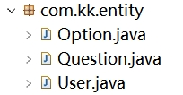

# JavaWeb课程设计--多功能小世界

## 一、**课题介绍**

登录页：

 

用户名密码不匹配：

 

注册页：

 

进去后，主页整合了上课讲过的三个小功能。

 

第一个，乘法答题

 

随机生成个位数乘法题，一共有四题，全部答完显示：

 

接下来，返回主页，心理测试：

 

数据库内目前只存了三题，后续可以完善。

测试结果如下：不同情况如下

 

 

第三个功能，猜数字游戏

 

 

 

然后是退出登录页：（并非注销）

 

3秒后跳转登录页。

## **二、分析与设计**

按设计过程写，写明数据库表和各个包、类的作用，对所遇到的问题和解决方法一并记录

#### 1.首先采用了MVC三层结构：

表示层（View）：JSP 页面实现用户交互界面。

控制层（Controller）：Servlet 控制业务流程。

持久层（DAO + Entity）：使用 MyBatis 实现数据库访问和映射。

#### 2. 数据库设计

本系统主要涉及以下四张表：

| 表名      | 说明           | 主要字段                                     |
| --------- | -------------- | -------------------------------------------- |
| users     | 用户信息表     | id, username, password                       |
| questions | 心理测试题目表 | id, question                                 |
| options   | 测试选项表     | id, question_id, option_text, score          |
| results   | 测试结果表     | id, score_range_min, score_range_max, result |

 

#### 3.包与类结构

在老师给的MVC三层结构的基础上进行调整修改和补充。

项目中各包和类的功能如下：

（1）com.kk.entity 实体类包

User：用户实体，映射 users 表。

Question：题目实体，包含题干及选项集合（List<Option>）。

Option：选项实体，含选项文本与分值。

 

（2）com.kk.dao 数据访问层

UserDao.xml：实现用户登录校验与注册。

QuizDao.xml：实现题目与选项的联合查询（使用 resultMap 映射）。

（3）com.kk.util 工具类包

MyBatisUtil：封装 SqlSessionFactory，便于获取 SqlSession。

（4）com.kk.controller包：

 

（5）com.kk.dao包

 

（6）com.kk.exception包

 

（7）com.kk.service包

 

（8）mybatis-config.xml和MyBatisUtil.java

（9）JSP 页面（前端）

index.html：登录入口页面。

（10）在做乘法答题功能时补充了一个ResultServlet.java用于统计答题分数

（11）乘法答题功能的TestServlet.java

4.遇到的问题与解决方法

问题一：MyBatis 无法正确映射题目与选项集合

表现：quiz.jsp 页面题目正常显示，但选项加载失败。

原因分析：resultMap 中未正确设置 collection 的列前缀，或者别名与属性不匹配。

解决办法：给 SQL 查询中的选项字段加前缀，如 option_，并在 resultMap 中用 columnPrefix="option_" 处理。

问题二：JSP 页面抛出 NullPointerException

表现：quizResult.jsp 页面报 HTTP 500 错误。

原因分析：MyBatis 查询返回 null，但未判断。

解决办法：增加空值判断；或检查 Mapper 中 SQL 是否正确、传参是否符合格式。

问题三：ClassNotFound 异常

表现：启动时报错找不到 com.kk.pojo.Question。

原因分析：Mapper 文件中使用了错误的类路径。

解决办法：确保所有实体类路径一致使用 com.kk.entity。

## **三、总结**

通过本次心理健康科普平台的开发实践，我深入了解并掌握了 Java Web 开发的完整流程，包括前期的需求分析与数据库设计，中期的代码实现与调试，后期的测试与优化。项目整体采用 JSP + Servlet + MyBatis 框架，完成了用户注册登录、心理测试答题、结果评估与显示等核心功能。

在开发过程中，我遇到了一些挑战，例如 MyBatis 中复杂对象映射问题、JSP 页面数据展示失败、SQL 查询结果为空等问题。通过查阅文档、调试代码以及与同学讨论，我逐一定位并解决了这些问题。这一过程锻炼了我分析问题和解决问题的能力，也加深了我对三层架构、MVC 模式和数据库交互的理解。

此外，我也意识到了在前后端协作中的细节处理重要性，例如字段命名一致性、Mapper 映射准确性、空值判断等，这些都对系统的稳定性与可维护性有重要影响。

## **四、参考资料**

有没有用到课程外的书籍或资源？如果有请列出

\1. MyBatis 官方文档

网址：https://mybatis.org/mybatis-3/

用途：理解 resultMap、collection、多表联合查询时的对象映射规则。

应用实例：调试 getAllQuestionsWithOptions 时查阅文档解决 options 显示为空 问题。

\2. Tailwind CSS 官网

网址：https://tailwindcss.com/

用途：用于前端页面美化，快速构建响应式界面。

应用实例：设计 quiz.jsp 和 welcome.jsp 页面时使用了 bg-gradient-to-br, rounded-xl, hover:bg-* 等实用类。
